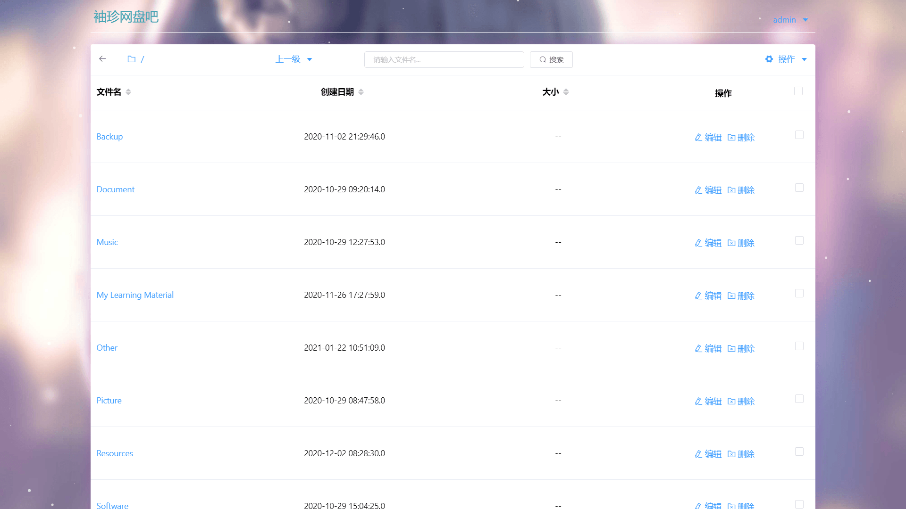
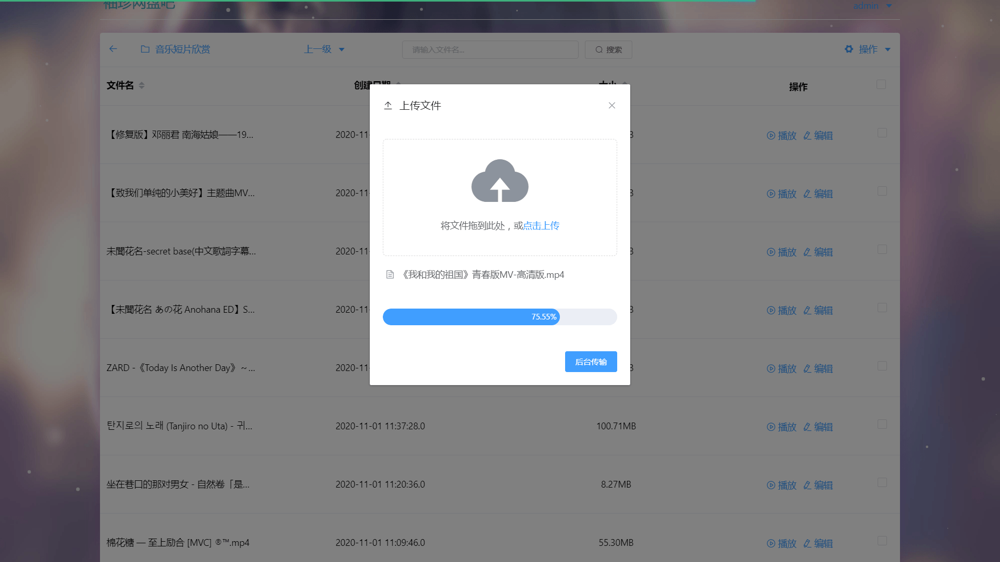
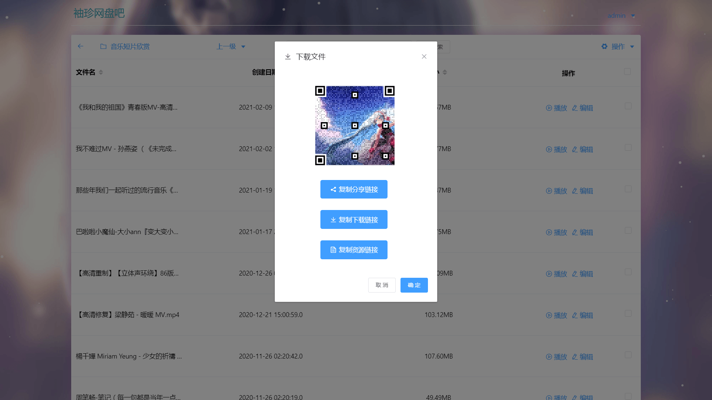
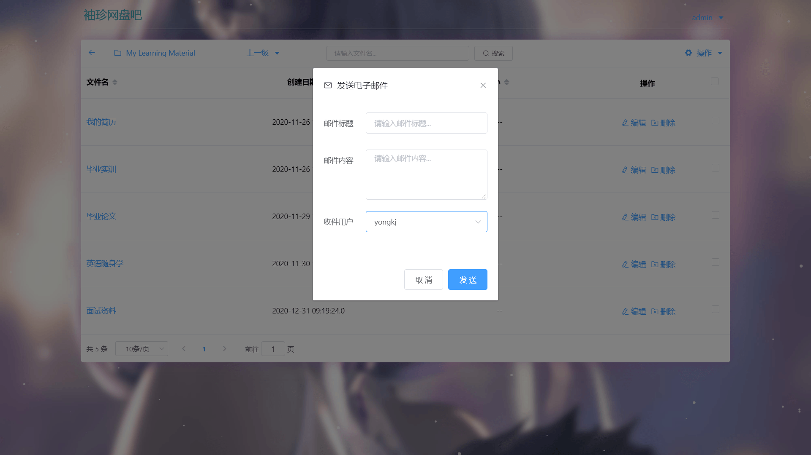
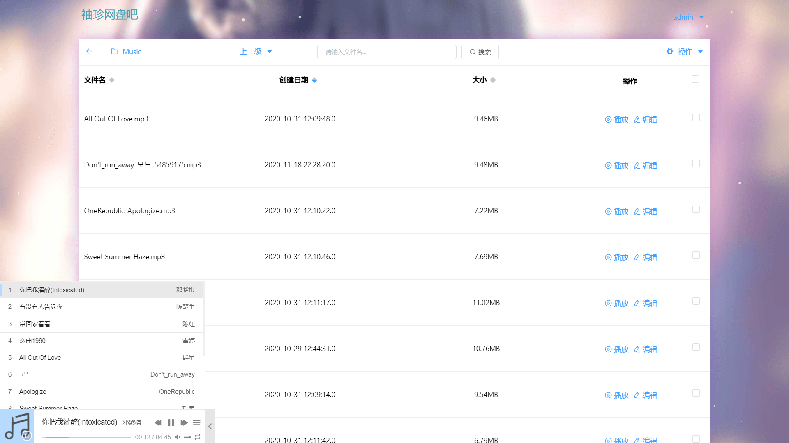
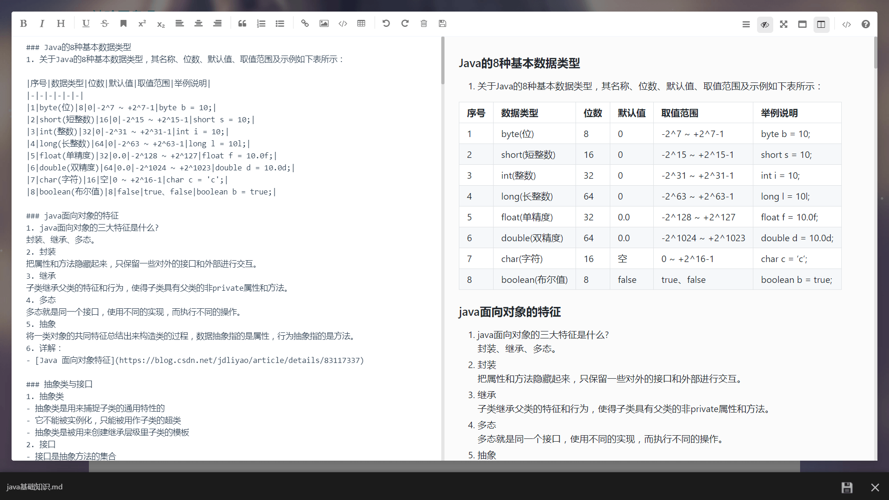
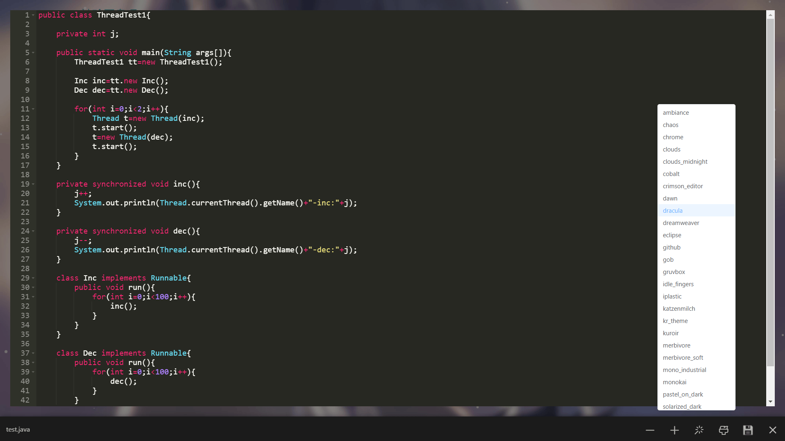
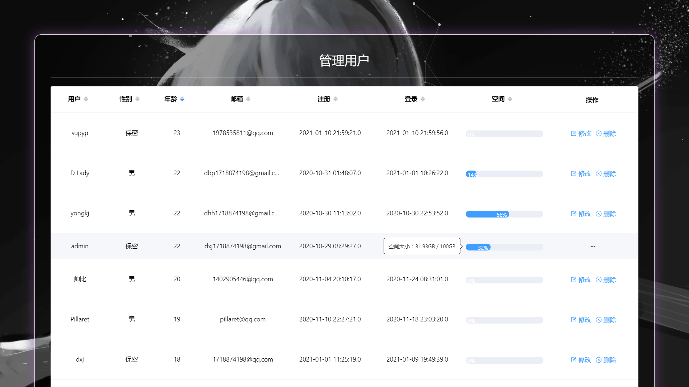

# 袖珍网盘吧 OSS 版（后端）

#### 介绍
本项目通过设计与开发一个小巧实用的个人网盘，轻松管理上传的文件，在线预览一些常见媒体文件，实现文件的快速共享功能。主要功能包括：登录注销、文件管理、文件回收站、文件在线预览、文件共享、邮件发送等。

#### 链接
袖珍网盘吧 OSS 版：[http://cloud.yongkj.cn/](http://cloud.yongkj.cn/)

#### 截图

#### 技术栈
MySQL+OSS SDK+SpringBoot+Spring+SpringMVC+MyBatis

1.  本系统采用前后端分离的开发方式，彼此之间通过json数据进行交互
2.  后台数据接口则使用 SpringBoot 来整合 SSM 框架（Spring + SpringMVC + MyBatis）开发
3.  通过添加 CORS 全局配置解决跨域访问，实现项目的前后端分离
4.  采用 JavaMail 来完成 163 邮箱的邮件发送功能
5.  文件回收站的每天定时删除过期文件主要使用 Quartz 定时任务框架来完成
6.  利用阿里对象存储（OSS）容量弹性扩展的特性实现文件的海量存储
7.  后台的数据存储主要采用开源的Mariadb数据库来完成

#### 功能特性

1.  需要使用邮箱地址并获取邮箱验证码才能注册新账号，忘记密码也可使用邮箱验证码来重置密码，另外，管理员账号可以对用户账号进行管理
2.  每个用户的初始空间大小为1GB，当执行上传文件、删除文件或编辑文本文件的操作后，用户当前可使用的空间大小就会得到更新
3.  可对文件和文件夹进行基本的一些操作，可以新建文件夹，文件夹重命名，删除文件夹，也可以上传文件，下载文件（点击文件名即可下载文件），文件重命名，删除文件
4.  可以发送文件下载链接（http或者https链接）到服务器上，实现文件的离线下载
5.  文件批量管理功能，批量移动文件或文件夹，批量删除文件或文件夹，批量上传文件
6.  文件排序功能，可对当前目录下的文件或文件夹进行排序操作，可以按照文件名、创建日期和文件大小升序或者降序排列
7.  文件搜索功能，可对当前目录下的文件或子文件夹进行搜索操作，方便对文件或文件夹执行其他操作
8.  文件夹刷新功能，可以刷新当前目录，更新当前目录下的文件和文件夹，方便手机和电脑之间共享文件，当手机上传文件后，电脑即可刷新当前目录，查看上传的新文件
9.  文件预览功能，可以在线预览常见的媒体文件，例如浏览图片文件，播放音频文件，观看视频文件，查看文本文件等等
10. 可以查看和编辑常见的文本文件，例如可以高亮显示和编辑java文件、html文件、python文件、c文件等，此外，还专门使用mavonEditor为markdown文件提供良好的编辑体验
11. 删除的文件会保存到文件回收站中，保留的时间是7天，用户可在文件回收站中恢复或彻底删除文件。每天凌晨3点将会对回收站中的过期文件进行清理
12. 支持文件流式下载，点击文件名称即可弹出下载框，点击确定即可下载文件，另外，下载框中有文件的共享二维码，也可以复制文件的共享、下载以及资源链接
13. 用户可以将使用过程中遇到的问题进行反馈，管理员则能够通过邮件发送的方式向用户发送消息

#### 使用说明

1.  pocket_yun_new.sql 为数据库备份文件
2.  可在 src/main/resources/application.properties 配置文件中修改数据库连接信息
3.  如需打包部署服务器，则可以使用 Eclipse 或者 IDEA 打包项目，默认打包为 Jar 包
